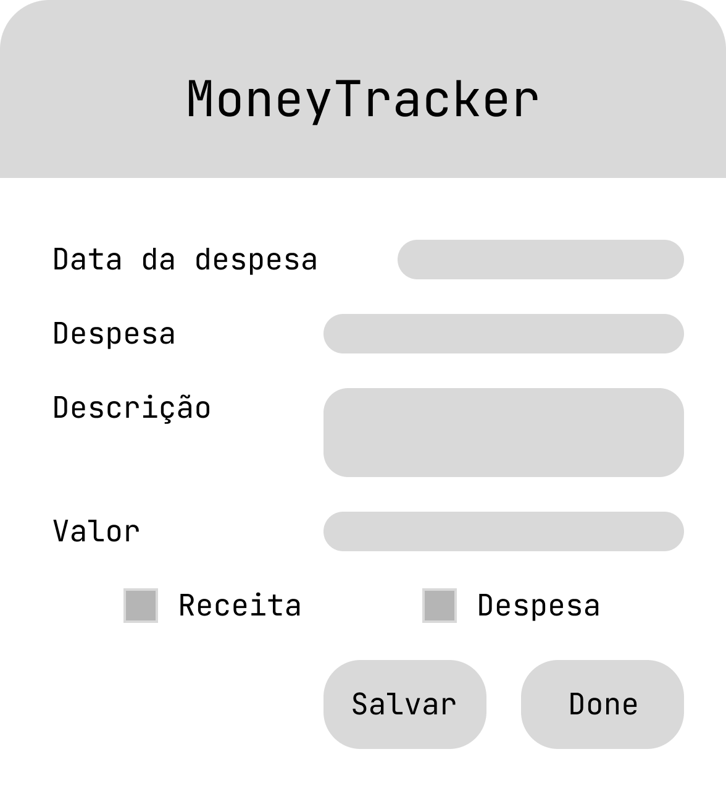
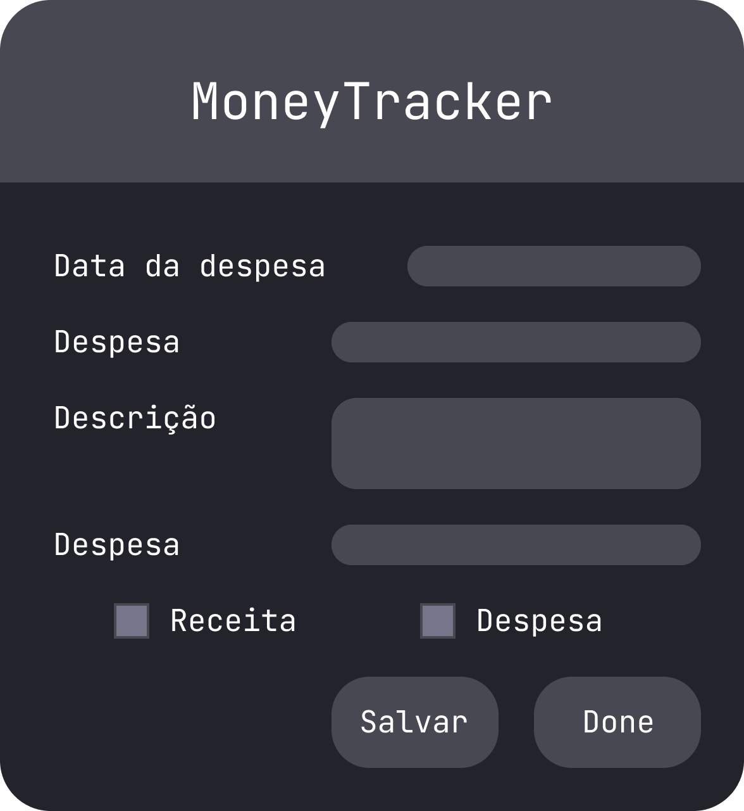

# MoneyTracker

→ App de finanças pessoais mensais que exporta em numa tabela Excel os gastos do mês

---

### Design


<p>White mode</p>

<p>Dark mode</p>

https://www.figma.com/file/IBfKFdwnNDTtahXy5gI1am/MoneyTracker

---

### Como Utilizar?

1. Instalar o **Python** e as **bibliotecas** nessessárias
    
    Transferir o **python** mais recente do site oficial.
    
    [Python.org](http://python.org)
    
    Instalar o **openpyxl**
    
    ```bash
    pip install openpyxl
    ```
    
2. Instalar o **MoneyTracker** (Clonar o repositório do GitHub)
    
    ```bash
    git clone https://github.com/manuelcsilva/MoneyTracker.git
    ```
    
3. Executar o Programa
    
    Mudar para o diretório do programa
    
    ```bash
    cd MoneyTracker
    ```
    
    Executar o python
    
    ```bash
    python gui.py
    ```
    
4. A interface gráfica
    - No campo “**Data da Despesa**” a data devera estar no formato **DD/MM/AAAA**
    - No campo “**Despesa**” devera ser inserido uma identificação para a despesa ou receita
    - No campo “**Descrição**” devera ser inserido uma breve descrição da despesa ou receita
    - No campo “**Valor**” devera ser indicado o valor gasto ou recebido
    - Nas caixa “**Receita**” e ”**Despesa**” devera ser indicado se o valor foi **gasto**(Despesa) ou **recebido**(Receita)